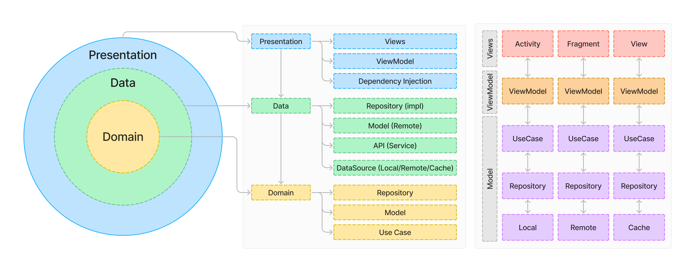

# GameX
GameX is your ultimate gaming companion! 📱 Explore a vast list of games, view detailed information about each title, and save your favorites to a personalized list. Stay organized and never miss out on the games you love. Perfect for every gaming enthusiast! 🎮✨

## ✨ Features

- 🏠 **Home**
  - 🎮 Browse a list of popular games (*Hot Games*).
  - 🆕 Explore the latest games fetched from the [RAWG API](https://rawg.io/).

- 🔍 **Search**
  - 🔎 Find any game available in the API with the built-in search feature.

- 📌 **Bookmarks**
  - ⭐ Save your favorite games to a personalized list for quick access.

- 🕹️ **Game Details**
  - 📄 View detailed information about each game.
  - ⭐ **Rating**: Check the game's rating.
  - 🎥 **Trailer**: If a trailer is available, you can watch it directly in the app.

# Preview
  

# Screenshots
  

# Architecture
- Presentation: Responsible for the UI and input management
- Domain: Contains the business logic, including the use cases and repository interfaces
- Data: Responsible for database operations, network requests and caching.



# Technologies Used
|                                                                                                                    |                                                                                            |                                                                                     |
|--------------------------------------------------------------------------------------------------------------------|------------------------------------------------------------------------------------------- |-------------------------------------------------------------------------------------|
|  | [**Kotlin**](https://kotlinlang.org/)                                           | Official language for Android development, known for its concise syntax             |
|                  | [**Jetpack Compose**](https://developer.android.com/jetpack/compose)                       | A modern toolkit for building native Android UIs                                               |                                        |
|                                      | [**ViewModel**](https://developer.android.com/topic/libraries/architecture/viewmodel)      | Retains UI data across configuration changes                                        |
|                                      | [**Navigation Components**](https://developer.android.com/guide/navigation/navigation-getting-started) | Simplifies app navigation                                               |
|                                    | [**Retrofit**](https://square.github.io/retrofit/)                                         | A type-safe HTTP client for making API requests                                     |
|                                      | [**Room**](https://developer.android.com/training/data-storage/room)                       | A persistence library for local database management        coroutines                       |                                                |
|                                                | [**Rawg**](https://rawg.io/)                                                        | The biggest video game database                                                             |
|                        | [**Hilt**](https://dagger.dev/hilt/)                                                       | A dependency injection library that simplifies injecting dependencies in Android apps |
|                               | [**OkHttp**](https://square.github.io/okhttp/)                                             | A networking library for HTTP requests                                              |
|                                         | [**JUnit**](https://junit.org/junit5/)                                                     | A testing framework for writing unit tests                                          |
|                                  | [**MockK**](https://mockk.io/)                                                             | A mocking framework for unit testing Kotlin code                                    |
|                                   | [**Turbine**](https://github.com/cashapp/turbine)                                          | A testing library for Kotlin Flows                                                  |

# Requirements

- Android 8.0 (API level 26) or higher  
- Stable internet connection  

# Build setup
App is using the following keys to work:

Rawg IO
- Since both of these keys refer to `buildConfig`, create your own API keys and add them in your `local.properties`:
```
API_KEY = <YOUR_RAWG_API_KEY>
```
